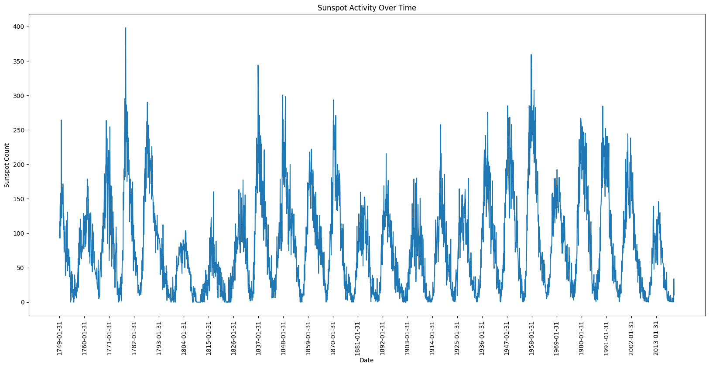
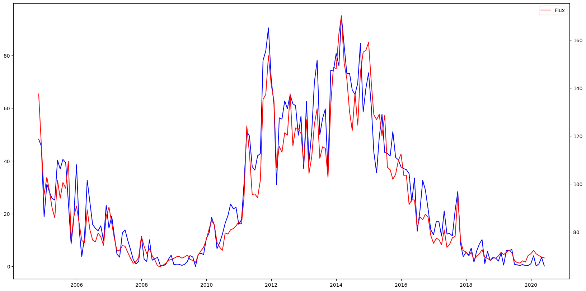
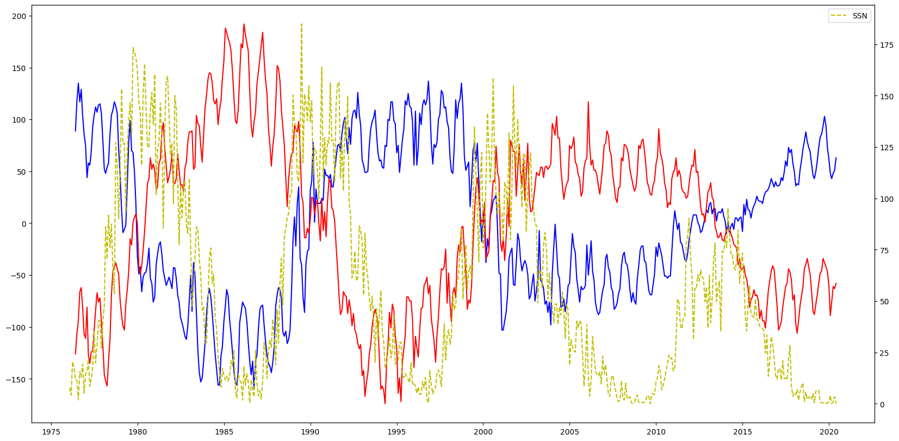
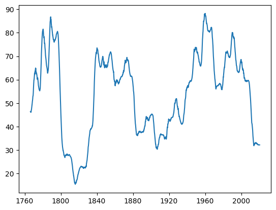
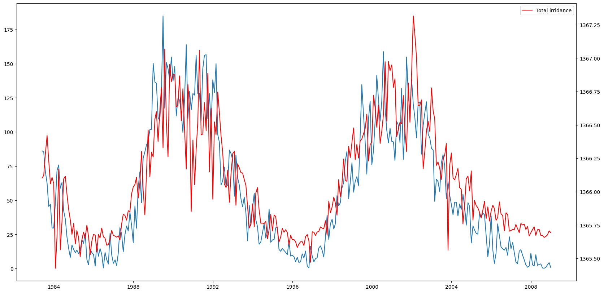
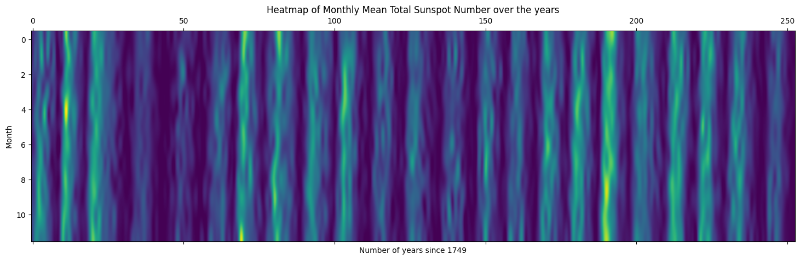
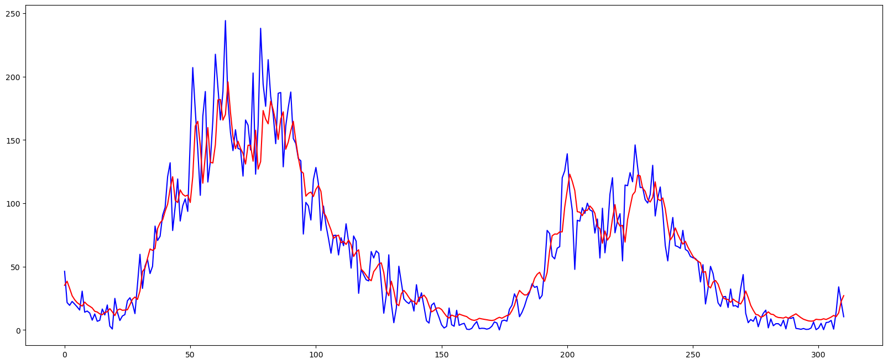

# SolarCycle-analysis_and_prediction

## 🌞 Sunspot Cycle Analysis

Solar cycles or Sunspot cycles are approximately **11-year cycles** during which the Sun's magnetic activity fluctuates. These cycles are characterized by changes in the number of sunspots, solar flares, and other solar phenomena.

Understanding solar cycles is crucial for predicting space weather, which can impact **satellite operations**, **communication systems**, and even **power grids** on Earth.

---

## 🎯 Objective

The objective of this analysis is to **visualize and understand patterns** in solar cycles using historical sunspot number data. By analyzing these patterns, we aim to gain insights into the behavior of solar activity and how it affects various activities over time.

---

## 📊 Historical Sunspot Cycle

This graph shows the **monthly sunspot numbers from 1749 to 2021**. Each solar cycle starts from a minimum number of sunspots (*solar minimum*), rises to a maximum number (*solar maximum*), and then declines back to a minimum.

- The cyclical pattern repeats approximately every **11 years**
- The full cycle can range from **9 to 14 years**
- During each cycle, the Sun undergoes significant changes affecting **solar radiation and space weather**

---

## 🔁 Comparing Radio Flux with Sunspot Number

- **Sunspot Number**: Direct measure of solar magnetic activity  
- **Radio Flux (10.7 cm)**: Indirect measure via radio energy emission

This graph displays **International Sunspot Numbers (ISN)** in blue and **10.7 cm radio flux** in red from 2004 to 2020. Both indicators exhibit closely aligned patterns, rising and falling together, suggesting a **strong correlation**.

> 🔍 Slight amplitude differences arise due to their distinct measurement methods.

---

## 🧲 Comparing Polar Field with Sunspot Number

- **Sunspot Numbers**: Indicate solar activity levels  
- **Polar Field Strength**: Refers to magnetic field intensity at solar poles

This graph shows an **inverse relationship**:
- When **sunspot numbers increase** (solar maximum), **polar field strength peaks**
- The **Sun's magnetic field reverses every ~11 years**, causing the north and south poles to **switch polarity**

---

## 🌀 Seasonality and Lag Analysis

Lag plots help assess randomness. A **pattern in lag plots** implies predictive potential.

- The **moving average** plot highlights cycles and valleys
- Clear dip from **1790 to 1820** → **Dalton Minimum**
- Peak around **1960**, followed by fluctuations till present

These plots reveal **non-random patterns** and emphasize the **cyclical nature** of sunspot data.

---

## 🔆 Comparing Total Solar Irradiance (TSI) with Sunspot Numbers

- **Total Solar Irradiance (TSI)**: Solar energy received at the top of Earth's atmosphere
- **Sunspot Number**: Proxy for solar magnetic activity

A **positive correlation** is observed:
- As **sunspot numbers rise**, **TSI increases**
- Indicates **higher solar activity leads to higher solar irradiance**

---

## 📈 Asymmetry and Long-Term Seasonality

The **heatmap reveals two main cycles**:
1. A short-term **~11-year solar cycle**
2. A long-term **~100-year brightness cycle**

Notable Observations:
- Bright bands show **seasonal oscillation**
- **If brightness increases**, it tends to continue increasing for a while
- Suggests a **century-scale periodicity**

---

## 📌 Conclusion

The solar cycle is not only a fascinating phenomenon of astrophysics but also a crucial factor in space weather prediction. With visual and statistical tools, this analysis provides a deeper understanding of solar behavior — and lays the groundwork for more advanced modeling with machine learning approaches like LSTM.

---

# Solar Sunspot Number (SSN) Time Series Forecasting with LSTM

This project implements a Long Short-Term Memory (LSTM) neural network to forecast Solar Sunspot Numbers (SSN), which are important indicators of solar activity.

## Project Overview

The goal is to predict future SSN values using historical data. The approach includes:
- Data preprocessing with MinMax scaling
- Feature engineering with lagged variables
- LSTM model architecture
- Baseline model comparison
- Performance evaluation using Mean Absolute Error (MAE)

## Key Features

- **Data Preparation**: Created lagged features (16 time steps) for time series forecasting
- **Model Architecture**: 3-layer LSTM network with 32 units each
- **Training Optimization**:
  - Learning rate reduction on plateau
  - Early stopping to prevent overfitting
- **Evaluation**: Comparison against a simple baseline model

## Results

- Baseline MAE: [value from your baseline_mae]
- LSTM MAE: 13.29 (inverse transformed)
  
 

## Code Structure

1. **Data Loading & Preprocessing**
   - MinMax scaling applied to SSN values
   - Partial autocorrelation analysis to determine lag length

2. **Feature Engineering**
   - `shift()` function creates lagged features for training set
   - `shift_test()` function creates lagged features for test set

3. **Model Building**
   - Sequential LSTM model with 3 layers
   - Adam optimizer with MSE loss function
   - Callbacks for learning rate adjustment and early stopping

4. **Evaluation**
   - MAE calculation on inverse-transformed data
   - Visual comparison of predictions vs actual values

## Requirements

- Python 3.x
- Libraries:
  - NumPy
  - Pandas
  - Matplotlib
  - scikit-learn
  - statsmodels
  - TensorFlow/Keras

## Usage

1. Mount Google Drive (if using Colab)
2. Load and preprocess your SSN data
3. Run the model training cells
4. Evaluate using the provided functions

## Future Improvements

- Experiment with different lag lengths
- Try alternative architectures (GRU, ConvLSTM)
- Incorporate exogenous variables
- Implement hyperparameter tuning

